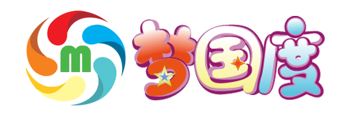
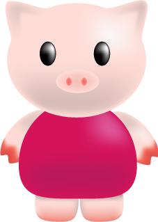

【 梦盟科技出品 http://mengmeng.github.io ，官网http://mengmeng.tech】

### 上课

- 本章将学习机器学习的基本概念和K近邻方法。(k-nearest neighbor,k-NN)是一种基本分类与回归方法。

#### 老师
- AI大师 

#### 听众
- 圆圆 
- 莉莉 
- 步步 
- 萌萌 
- 萝箩 
- 明明 

#### 实战项目
- 文字识别 
- 推荐系统 

 分类问题：知道这个数据集是有多少种类的
 聚类来说：在对数据集操作时，我们是不知道该数据集包含多少类，我们要将数据集中相似的数据归纳在一起
 回归问题：预测数值
 