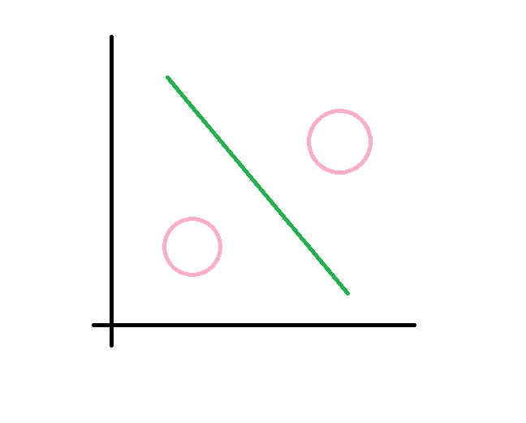

 第三章 聚类算法
 
 本章内容
 - 学习根据欧式距离解决难题。
 - 
 
 
 #### 1.1 解决什么问题？
 
我们需要知道全部用户倾向于使用什么方面忠实用户;
- 支付宝
- 微信
- 银联

我们需要划分出来全部用户的行为特征，但是我们
k-means，上面的k近邻
下面

#### 1.2 人脸识别
 https://paperswithcode.com/paper/towards-a-principled-integration-of-multi
 舞蹈动作是否到位
 
 https://github.com/huanghoujing/person-reid-triplet-loss-baseline
 正确的绿色框，错误的红色大框。
 
 
 
 
 
 
 先举一个现实世界中我们区分动物的小例子，
  
 首先，先看一张和谐的图片，能区分出兔兔和小鸭子吗？
 - 鸭和兔 
 
 有人会说，我们想这也简单了吧。
 兔子有耳朵，鸭子有长的嘴巴。
 
 
 好，然后再看这张图片，是鸭子还是兔兔呢？
 - 兔或鸭 
 
 这个图很多人就有不同的看法了，有的人先看到鸭子，有人先看到兔子，有人又同时看到。
  
 实际上，我们判断时候脑子里会搜索脑海中鸭子和兔兔的记忆，看他的邻居，比如看最像的三个邻居。你第一眼看到的基本上接近你记忆中最贴近的那种。

 - 想法 
  
  

 
 ### 1.2 推荐系统
 ### 1.2.1 特征抽取
 - 服装搭配 
 【Neo4j图】
 
 如何服装搭配打分？
 找到优秀搭配的特征图。
例如，可以选择一对袜子与鞋子相匹配，但不特别选择鞋子。
兼容的装备应具有关键属性：如，不会有两双鞋子在一个装备）。 

在同一套装中，如果是两个类别有匹配关系,应该是他们之间的互动。我们有两个有向边
他们之间在Fashion Graph中，因为两个方向的互动应该是不同的。 

方法：Graph Neural Networks
优化：Gated Graph Neural Network (GGNN)

 
流程 
  
 #### 1.2.2 推荐系统
 假设你不仅要向Mengmeng推荐服装，还要预测她将给喜欢这个装扮的程度。
 分类就是编组，找出类似的人。
 回归就是预测结果。
 
 方法：
 为此，先找出与她最近的5个人。 对他们的评价求平均数。
 
 【ppt配图】
 
 代码： https://github.com/CRIPAC-DIG/NGNN
 
 
 #### 1.2.3 挑选合适的特征
 我们怎么选合适的特征呢？
 一般情况下，在对某一数据集构建模型之前，
 都需要考虑从数据集中去除这五种类型的特征，
 所以feature-selector帮你省去data-science生活中一部分重复性的代码工作
 feature-selector属于非常基础的特征选择工具，它提供了五种特征的选择函数，
 每个函数负责选择一种类型的特征
 
 - https://github.com/WillKoehrsen/feature-selector   
 -  http://www.mamicode.com/info-detail-2367325.html   
 -  https://ask.hellobi.com/blog/python_shequ/18706   
（后两个是中文版介绍）

#### 1.3 练习一下
#### 1.3.1 MengMeng学汉字
OCR指的是光学字符识别 （optical character recognition），这意味着你 可拍摄印刷页面的照片，计算机将自动识别出其中的文字。Google使用 OCR来实现图书数字化。OCR是如何工作的呢？我们来看一个例子。请 看下面的数字。
如何自动识别出这个数字是什么呢？可使用KNN。 (1) 浏览大量的数字图像，将这些数字的特征提取出来。 (2) 遇到新图像时，你提取该图像的特征，再找出它最近的邻居都是 谁！
这与前面判断水果是橙子还是柚子时一样。一般而言，OCR算法提取线 段、点和曲线等特征。
遇到新字符时，可从中提取同样的特征。

【ppt配图】

https://github.com/xiaofengShi/CHINESE-OCR
 

#### 1.3.2　预测交通拥堵
https://github.com/liyaguang/DCRNN
 
 
 
 
   

