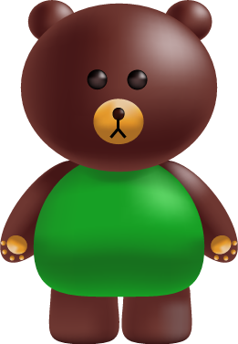
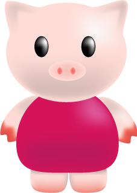
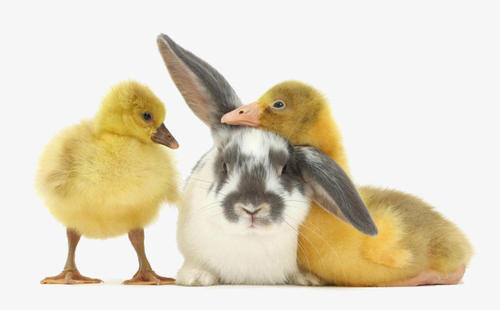
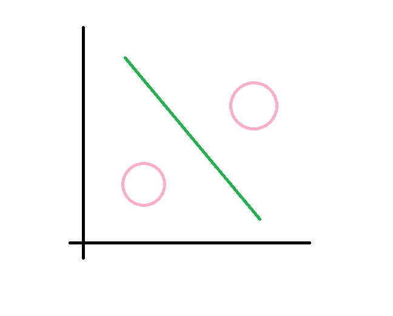

【 梦盟科技出品 http://mengmeng.github.io ，官网http://mengmeng.tech】

 Exodus（出埃及记） 片头曲
 
### 上课

- 本章将学习机器学习的基本概念和K近邻方法。(k-nearest neighbor,k-NN)是一种基本分类与回归方法。

#### 我的未来学院
Future Acadamic （功夫熊猫）

#### 科目

语文、数学、英语、物理、历史、地理、生物、品德、音乐、美术、体育、信息。

#### 老师
- AI大师 

#### 听众
- 圆圆 
- 莉莉 
- 步步 
- 萌萌 
- 萝箩 
- 明明 

方法学

 先聚类，再分类，然后回归验证。
 分类问题：知道这个数据集是有多少种类的
 聚类来说：在对数据集操作时，我们是不知道该数据集包含多少类，我们要将数据集中相似的数据归纳在一起
 回归问题：预测数值
 
- 序幕
先举一个现实世界中我们区分动物的小例子，
  
 首先，先看一张和谐的图片，能区分出兔兔和小鸭子吗？
 - 鸭和兔 
 
 有人会说，我们想这也简单了吧。
 兔子有耳朵，鸭子有长的嘴巴。
 
 
 好，然后再看这张图片，是鸭子还是兔兔呢？
 - 兔或鸭 
 
 这个图很多人就有不同的看法了，有的人先看到鸭子，有人先看到兔子，有人又同时看到。
  
 实际上，我们判断时候脑子里会搜索脑海中鸭子和兔兔的记忆，看他的邻居，比如看最像的三个邻居。你第一眼看到的基本上接近你记忆中最贴近的那种。

 - 想法 

