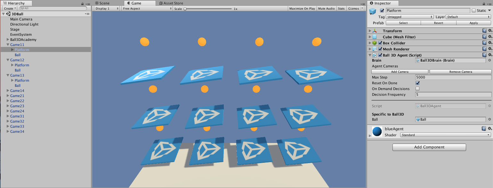
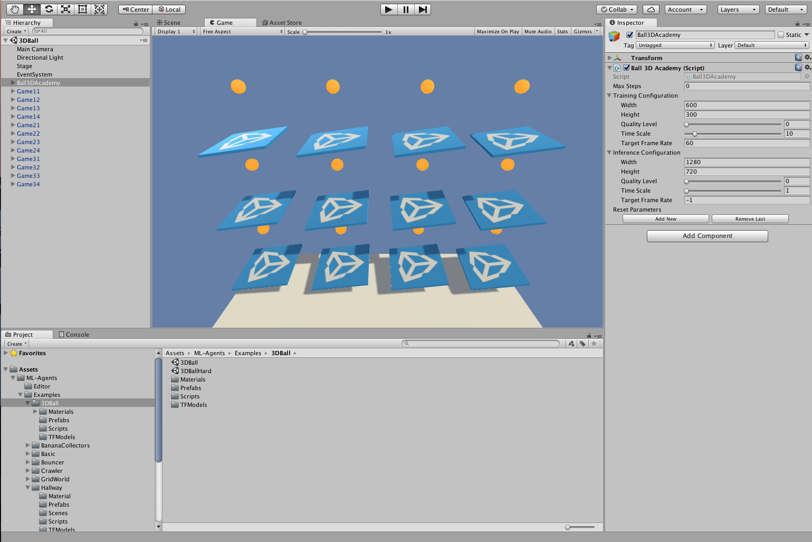
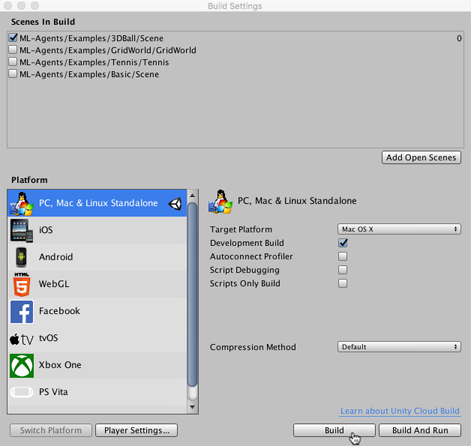
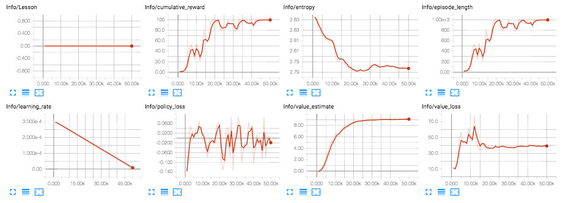

# 3D Balance Ball 环境入门

本教程介绍在 Unity 中打开 ML-Agents 示例环境、
构建 Unity 可执行文件、在其中训练 agent 以及
最终将经过训练的模型嵌入到 Unity 环境中的端到端过程。

ML-Agents 包含大量[示例环境](Learning-Environment-Examples.md)，
您可以通过这些环境来了解 ML-Agents 的
不同使用方式。这些环境也可以用作新环境的模板
或用作测试新 ML 算法的方法。阅读本教程后，
您应该能够了解并构建示例环境。


本演练过程将使用 **3D Balance Ball** 环境。3D Balance Ball 包含
大量平台和球（它们都是彼此的副本）。
每个平台都会试图通过水平或垂直旋转的方式
防止球掉落。在这种环境下，平台是一个 **agent**，
可以在对球进行平衡的每一步中获得奖励。agent 也会
因为掉球而得到负奖励（惩罚）。训练过程的
目标是让平台学会绝不掉球。

让我们开始吧！

## 安装

为了安装和设置 ML-Agents、Python 所依赖的库和 Unity 软件，
请参阅[安装说明](Installation.md)。

## 了解 Unity 环境 (3D Balance Ball)

agent 是一种观测并与_环境_交互的
自主参与者 (actor)。在 ML-Agent的语境下，环境是一个包含一个 Academy， 一个或多个 Brain， 一个或多个Agent， Agent 与其他实体交互的场景。



**注意：**在 Unity 中，场景内所有元素的基础对象均为
_游戏对象_(GameObject)。游戏对象本质上是其他任何元素
（包括行为、图形、物理等）的容器。要查看组成游戏对象的组件，
请在 Scene 窗口中选择 GameObject，然后打开 
Inspector 窗口。Inspector 会显示游戏对象上的每个组件。
 
在打开 3D Balance Ball 场景后，您可能会首先注意到它包含的
不是一个平台，而是多个平台。场景中的每个平台都是
独立的 agent，但它们全部共享同一个 Brain。3D Balance Ball 通过
这种方式可以加快训练速度，因为所有 12 个 agent 可以并行参与训练任务。

### Academy

在这个示例场景中的 Academy 对象是 Ball3DAcademy 游戏对象。
当您在 Inspector 中查看该 Academy 组件时，可以看到若干
用于控制环境工作方式的属性。例如，Inspector中可以看到
**Training** 和 **Inference Configuration** 属性， 在其中我们可以设置之后生成的 Unity 可执行文件的
图形和 Time Scale 属性。Academy 在训练期间使用 
**Training Configuration**，而在不训练时使用 
**Inference Configuration**。（*Inference* 等同于**不**进行训练的任何时候，此时 agent 可以使用经过训练的模型控制，或用写定的代码控制，或让玩家直接控制。）
通常情况下，您需要为 **Training configuration** 设置低图形质量
和高Time Scale，而为 **Inference Configuration** 设置高图形质量和 
`1.0` 的Time Scale。

**注意：**如果您想在训练期间观测环境，则可以调整 
**Inference Configuration** 设置来使用更大的窗口和更接近 
1:1 的时间刻度。当你要正式训练时一定要重新设置这些参数；
否则，训练可能需要很长时间。

对于环境，另一个需要关注的方面是 Academy 的实现。
由于 Academy 基类是抽象的，您必须始终定义一个子类。
您可以实现以下三个函数，但这些函数都是可选的：

* Academy.InitializeAcademy() — 启动环境时调用一次。
* Academy.AcademyStep() — 在 
Agent.AgentAction() 之前（以及 agent 收集其观测结果之后）的每个模拟步骤调用。
* Academy.AcademyReset() — 在 Academy 开始或重新开始模拟
（包括第一次）时调用。

3D Balance Ball 环境不使用这些函数（每个 agent 在需要时
会自行重置），但许多环境都会使用这些函数来
控制 agent 周围的环境。

### Brain

场景中的 Ball3DBrain 游戏对象包含 Brain 组件，
是 Academy 对象的子级。（场景中的所有 Brain 对象都必须是 
Academy 的子级。）3D Balance Ball 环境中的所有 agent 使用
同一个 Brain 实例。
Brain 不存储关于 agent 的任何信息，
只是将 agent 收集的观测结果发送到决策过程，
然后将所选的动作返回给 agent。因此，所有 agent 可共享
同一个 Brain，但会独立行动。Brain 设置可以提供很多
关于 agent 工作方式的信息。

**Brain Type** 决定了 agent 如何决策。
**External** 和 **Internal** 类型需要协同使用：训练 agent 时使用 **External**，
而在采用经过训练的模型时使用 **Internal**。
**Heuristic** Brain 允许您通过扩展 Decision 类来对 agent 的逻辑进行
手动编码。最后，**Player** Brain 可让您将键盘命令
映射到动作，这样在测试 agent 和环境时
会非常有用。如果这些类型的 Brain 都不能满足您的需求，您可以
实现自己的 CoreBrain 来创建自有的类型。

在本教程中，进行训练时，需要将 **Brain Type** 设置为 **External**；
当您将经过训练的模型嵌入到 Unity 应用程序中时，需要将 
**Brain Type** 更改为 **Internal**。

**向量观测空间**

在决策之前，agent 会收集有关自己在环境中所处的状态的
观测结果。ML-Agents 将观测分为两类：
**Continuous** 和 **Discrete**。**Continuous** 向量观测空间
会收集浮点数向量中的观测结果。**Discrete** 
向量观测空间是一个状态表的索引。大多数示例环境
都使用连续的向量观测空间。

3D Balance Ball 示例中所用的 Brain 实例使用 **State Size** 为 8 的 
**Continuous** 向量观测空间。这意味着
包含 agent 观测结果的特征向量包含八个元素：
平台旋转的 `x` 和 `z` 分量以及球相对位置和
速度的 `x`、`y` 和 `z` 分量。（观测结果值
在 agent 的 `CollectObservations()` 函数中进行定义。）

**向量运动空间**

Brain 以*动作*的形式向 agent 提供指令。与状态
一样，ML-Agents 将动作分为两种类型：**Continuous** 
向量运动空间是一个可以连续变化的数字向量。向量
每个元素的含义都是由 agent 逻辑定义的（PPO 训练过程是一个了解agent的哪种状态更好的过程，这个过程是通过学习不同agent的不同状态会对应多少奖励来实现的）。
例如，一个元素可能表示施加到 agent 某个 
`Rigidbody` 上的力或扭矩。**Discrete** 向量运动空间将其动作
定义为一个表。提供给 agent 的具体动作是这个表的
索引。

根据设计，3D Balance Ball 示例会使用这两种类型的向量运动
空间。
您可以尝试使用两种设置进行训练，观测是否有
差异。（使用离散运动空间时将 `Vector Action Space Size` 设置为 4，
而使用连续运动空间时将其设置为 2。）
 
### Agent

Agent 是在环境中进行观测并采取动作的参与者。
在 3D Balance Ball 环境中，Agent 组件被放置在 12 个
平台游戏对象上。基础 Agent 对象有一些影响其行为的
属性：

* **Brain** — 每个 Agent 必须有一个 Brain。Brain 决定了 agent 如何
决策。3D Balance Ball 场景中的所有 agent 共享同一个 
Brain。
* **Visual Observations** — 定义 agent 用来观测其环境的
任何 Camera 对象。3D Balance Ball 不使用摄像机观测。
* **Max Step** — 定义在 agent 决定自己完成之前可以发生多少个
模拟步骤。在 3D Balance Ball 中，agent 在 5000 步之后重新开始。
* **Reset On Done** — 定义 agent 是否在完成时重新开始。
3D Balance Ball 将此项设置为 true，因此 agent 在达到 
**Max Step** 计数后或在掉球后重新开始。

也许 agent 更有趣的方面在于 Agent 子类的
实现。在创建 agent 时，您必须扩展 Agent 基类。
Ball3DAgent 子类定义了以下方法：

* Agent.AgentReset() — Agent 重置时（包括会话开始时）
调用。Ball3DAgent 类使用重置函数来重置
平台和球。该函数会将重置值随机化，从而使
训练不局限于特定的开始位置和平台
姿态。
* Agent.CollectObservations() — 在每个模拟步骤调用。负责
收集 agent 对环境的观测结果。由于分配给 
agent 的 Brain 实例设置为状态大小为 8 的连续向量观测空间，
因此 `CollectObservations()` 必须调用 8 次 
`AddVectorObs`。
* Agent.AgentAction() — 在每个模拟步骤调用。接收 Brain 选择的
动作。Ball3DAgent 示例可以处理连续和离散
运动空间类型。在此环境中，两种状态类型之间实际上
没有太大的差别：这两种向量运动空间在每一步都会
导致平台旋转发生小变化。`AgentAction()` 函数
为 agent 分配奖励；在此示例中，agent 在每一步
将球保持在平台上时收到较小的正奖励，
而在掉球时收到更大的负奖励。agent 在掉球时还会被标记为
完成状态，因此会重置一个用于下一模拟步骤的
新球。

## 构建环境

第一步是打开包含 3D Balance Ball 环境的 
Unity 场景：

1. 启动 Unity。
2. 在 Projects 对话框上，选择窗口顶部的 **Open** 选项。
3. 使用随后打开的文件对话框，找到 ML-Agents 项目内的 
`unity-environment` 文件夹，然后单击 **Open**。
4. 在 `Project` 窗口中，找到文件夹 
`Assets/ML-Agents/Examples/3DBall/`。
5. 双击 `Scene` 文件以加载包含 Balance Ball 环境的
场景。



由于我们要建立此环境来进行训练，因此我们需要
将 agent 使用的 Brain 设置为 **External**。这样 agent 在
进行决策时能够与外部训练过程进行通信。

1. 在 **Scene** 窗口中，单击 Ball3DAcademy 对象旁边的三角形
图标。
2. 选择其子对象 `Ball3DBrain`。
3. 在 Inspector 窗口中，将 **Brain Type** 设置为 `External`。


接下来，我们希望设置场景以便在训练过程启动我们的环境可执行文件时
正确播放场景。这意味着：
* 环境应用程序在后台运行
* 没有对话需要互动
* 正确的场景会自动加载
 
1. 打开 Player Settings（菜单：**Edit** > **Project Settings** > **Player**）。
2. 在 **Resolution and Presentation** 下方：
    - 确保选中 **Run in Background**。
    - 确保 **Display Resolution Dialog** 设置为 Disabled。
3. 打开 Build Settings 窗口（菜单：**File** > **Build Settings**）。
4. 选择目标平台。
    -（可选）选择“Development Build”以便
    [记录调试消息](https://docs.unity3d.com/Manual/LogFiles.html)。
5. 如果 **Scenes in Build** 列表中显示了任何场景，请确保
唯一选中的是 3DBall Scene。（如果该列表为空，则表示
仅当前场景包含在编译中）。
6. 单击 *Build*：
    a. 在 File 对话框中，导航至 ML-Agents 目录中的 `python`
    文件夹。
    b. 指定文件名，然后单击 **Save**。



## 使用 Reinforcement Learning（强化学习）来训练 Brain

有了一个包含模拟环境的 Unity 可执行文件后，现在我们
可以执行训练。为了首先确保您的环境和 Python 
API 能正常工作，您可以使用 `python/Basics` 
[Jupyter 笔记本](/book/en-US/Background-Jupyter.md)。
此笔记本包含了 API 功能的简单演练。
在 `Basics` 中，务必将 `env_name` 设置为您先前构建的
环境文件的名称。

### 使用 PPO 进行训练

为了训练 agent 对球进行正确平衡，我们将使用一种称为 Proximal Policy Optimization (PPO) 的 
Reinforcement Learning（强化学习）算法。
与其他许多 RL 算法相比，这种算法经证明是一种安全、
有效且更通用的方法，因此我们选择它作为与 ML-Agents 
一起使用的示例算法。有关 PPO 的更多信息，
请参阅 OpenAI 近期发布的[博客文章](https://blog.openai.com/openai-baselines-ppo/)，
其中对 PPO 进行了说明。


为了训练 Balance Ball 环境中的 agent，我们将使用 Python 
包。我们提供了一个名为 `learn.py` 的方便的 Python 包装脚本，此脚本会接受用于配置训练和预测阶段的参数。


我们将向这个脚本传递我们刚才构建的环境可执行文件的路径。（可选）我们可以
使用 `run_id` 来识别实验并创建用于存储模型和摘要统计信息的文件夹。当使用 
TensorBoard 来观测训练统计信息时，将每次训练的此项设置为顺序值
将会很有用。也就是说，第一次训练时为“BalanceBall1”，
第二次训练时为“BalanceBall2”，依此类推。如果不这样做，每次训练的
摘要信息都会保存在同一个目录中，并且全部将包含在
同一个图中。

总之，转到命令行，进入 `ml-agents` 目录并输入：

```
python3 python/learn.py <env_name> --run-id=<run-identifier> --train 
```

`--train` 标志告诉 ML-Agents 以训练模式运行。`env_name` 应该是刚才创建的 Unity 可执行文件的名字。


### 观测训练进度

开始使用 `learn.py` 按照前面部分所述的方式进行训练后，`ml-agents` 文件夹将
包含一个 `summaries` 目录。为了更详细地观测训练过程，
您可以使用 TensorBoard。从命令行中运行：

`tensorboard --logdir=summaries`

然后导航至 `localhost:6006`。

从 TensorBoard 中，您将看到摘要统计信息：

* Lesson - 只有在进行
[课程训练](/book/en-US/Training-Curriculum-Learning.md)时才有意义。
3D Balance Ball 环境中不使用此项。
* Cumulative Reward - 所有 agent 的平均累积场景奖励。
在成功训练期间应该增大。
* Entropy - 模型决策的随机程度。在成功训练过程中
应该缓慢减小。如果减小得太快，应增大 `beta` 
超参数。
* Episode Length - 所有 agent 在环境中每个场景的
平均长度。
* Learning Rate - 训练算法搜索最优 policy 时需要多大的
步骤。随着时间推移应该减小。
* Policy Loss - policy 功能更新的平均损失。与 policy
（决定动作的过程）的变化程度相关。此项的幅度
在成功训练期间应该减小。
* Value Estimate - agent 访问的所有状态的平均价值估算。
在成功训练期间应该增大。
* Value Loss - 价值功能更新的平均损失。与模型
对每个状态的价值进行预测的能力相关。此项
在成功训练期间应该减小。



## 将经过训练的 Brain 嵌入到 Unity 环境中（测试功能）

一旦训练过程完成，并且训练过程保存了模型
（通过 `Saved Model` 消息可看出），您便可以将该模型添加到 Unity 项目中，
然后将其用于 Brain 类型为 **Internal** 的 agent。

### 设置 TensorFlowSharp 支持

由于 TensorFlowSharp 支持仍处于实验阶段，因此默认情况下会
将其禁用。为了启用这项支持，必须遵循以下步骤。请注意，
只有完成这些步骤后才能使用 `Internal` Brain 模式。

1. 确保 TensorFlowSharp 插件位于 `Assets` 文件夹中。
可在
[此处](https://s3.amazonaws.com/unity-ml-agents/0.5/TFSharpPlugin.unitypackage)下载一个包含 TF# 的 Plugins 文件夹。
下载后，双击并将其导入。您可以在 Project 选项卡中
（位于 `Assets` > `ML-Agents` > `Plugins` > `Computer` 下）
检查 TensorFlow 的相关文件来查看是否安装成功
2. 转到 `Edit` > `Project Settings` > `Player`
3. 对于每个目标平台
（**`PC, Mac and Linux Standalone`**、**`iOS`** 或 **`Android`**）：
    1.转到 `Other Settings`。
    2.选择 `Scripting Runtime Version` 为
    `Experimental (.NET 4.6 Equivalent)`
    3.在 `Scripting Defined Symbols` 中，添加标志 `ENABLE_TENSORFLOW`。
    输入后，按 Enter。
4. 转到 `File` > `Save Project`
5. 重新启动 Unity Editor。

### 将经过训练的模型嵌入到 Unity 中

1. 经过训练的模型存储在 `ml-agents` 文件夹中的 `models/<run-identifier>` 内。训练
完成后，该位置会有一个 `<env_name>.bytes` 文件，其中的 `<env_name>` 是训练期间使用的可执行文件的
名称。
2. 将 `<env_name>.bytes` 从 `python/models/ppo/` 移入 
`unity-environment/Assets/ML-Agents/Examples/3DBall/TFModels/`。
3. 打开 Unity Editor，然后选择 `3DBall` 场景（如上所述）。
4. 从 Scene 层级视图中选择 `Ball3DBrain` 对象。
5. 将 `Type of Brain` 更改为 `Internal`。
6. 将 `<env_name>.bytes` 文件从 Editor 的 Project 窗口拖入 
`3DBallBrain` Inspector 窗口中的 `Graph Model` 占位区域。
7. 按 Editor 顶部的 Play 按钮。

如果您正确执行了这些步骤，您现在应该能够
看到 Unity 编辑器中有这个用于控制平衡球行为的
训练模型。从这里开始，您便可以重新构建 Unity 的可执行文件，
并单独运行该可执行文件，在其中内置 agent 新学到的行为。
