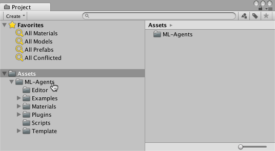
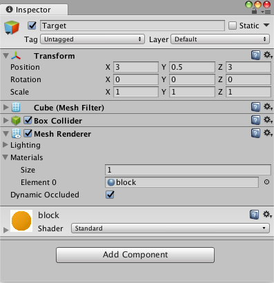
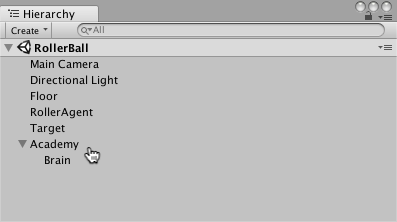
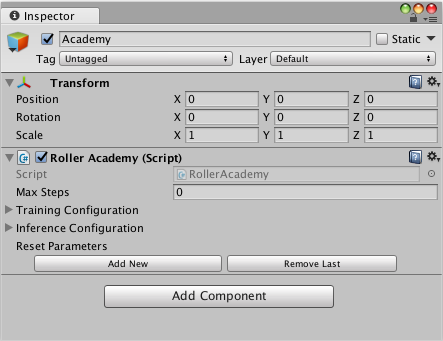
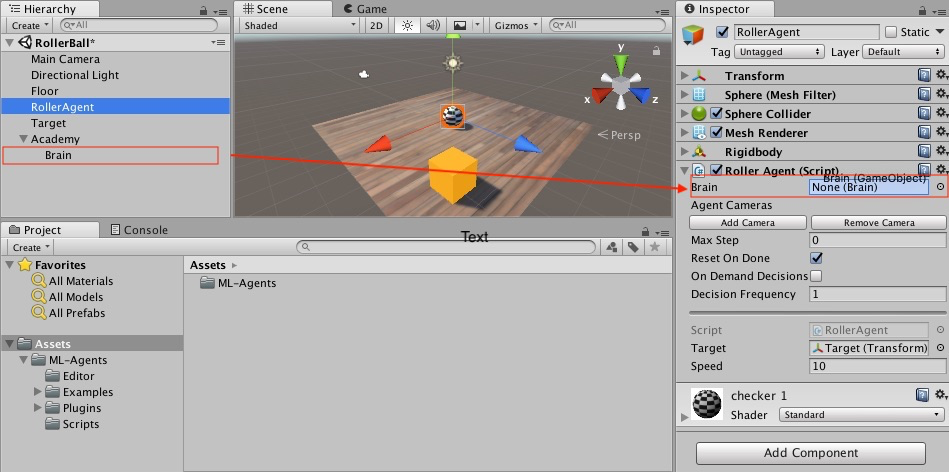
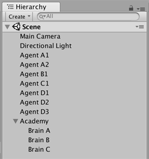

# 创建新的学习环境

本教程将介绍创建 Unity 环境的过程。Unity 环境是用 Unity 引擎构建的应用程序，可用于训练 Reinforcement Learning（强化学习）agent。


在此示例中，我们将训练一个球滚动到一个随机放置的立方体。这个球还要学习避免从平台上掉落。

## 概述

在 Unity 项目中使用 ML-Agents 涉及以下基本步骤：

1. 创建一个容纳 agent 的环境。从包含少量对象的简单物理模拟环境到整个游戏或生态系统，环境的形式可以多种多样。
2. 实现一个 Academy 子类，并将这个子类添加到包含该环境的 Unity 场景中的游戏对象 (GameObject)。此游戏对象将用作场景中任何 Brain 对象的父级。您的 Academy 类可以实现一些可选的方法，从而独立于任何 agent 来对场景进行更新。例如，您可以在环境中添加、移动或删除 agent 和其他实体。
3. 将一个或多个 Brain 对象作为 Academy 的子级添加到场景中。
4. 实现 Agent 子类。Agent 子类定义了必要的代码供 agent 用于观测自身环境、执行指定动作以及计算用于强化训练的奖励。您还可以实现可选方法，从而在 agent 完成任务或任务失败时重置 agent。
5. 将 Agent 子类添加到相应的游戏对象，通常是在场景内表示模拟中的 agent 的对象。必须为每个 Agent 对象分配一个 Brain 对象。
6. 如果要进行训练，应将 Brain 类型设置为 External 并[执行训练过程](/book/en-US/Training-ML-Agents.md)。

**注意：**如果您不熟悉 Unity，而本教程中未充分讲解 Editor 任务的情况下，请参阅 Unity 手册中的[了解界面](https://docs.unity3d.com/Manual/LearningtheInterface.html)。

如果尚未安装，请遵循[安装说明](Installation.md)。

## 设置 Unity 项目

要完成的第一项任务是创建一个新的 Unity 项目并将 ML-Agents Assets导入其中：

1. 启动 Unity Editor 并创建一个名为“RollerBall”的新项目。

2. 在你的文件系统中，找到包含您所克隆的 ML-Agents 代码仓库的文件夹。

3. 将 `ML-Agents` 文件夹从 `unity-environments/Assets` 拖到 Unity Editor Project 窗口中。

您的 Unity **Project** 窗口应包含  以下Assets：



## 创建环境：

接下来，我们将创建一个非常简单的场景来充当我们的 ML-Agents 环境。该环境的“physical”组件包括一个 Plane（充当 agent 移动的基础地板）、一个 Cube（充当 agent 寻找的目标）以及一个 Sphere（表示 agent 本身）。

**创建地板平板：**

1. 在 Hierarchy 窗口中右键单击，选择 3D Object > Plane。
2. 将游戏对象命名为“Floor”。
3. 选择 Plane 以便在 Inspector 窗口中查看其属性。
4. 将 Transform 设置为 Position = (0,0,0)、Rotation = (0,0,0)、Scale = (1,1,1)。
5. 在 Plane 的 Mesh Renderer 上，展开 Materials 属性并将默认材质更改为 *floor*。

（要设置新材质，请单击当前材质名称旁边的小圆圈图标。此时将打开 **Object Picker** 对话框，然后便可从项目中当前所有材质的列表中选择不同的材质。）


**添加目标立方体**

1. 在 Hierarchy 窗口中右键单击，选择 3D Object > Cube。
2. 将游戏对象命名为“Target”
3. 选择 Target 以便在 Inspector 窗口中查看其属性。
4. 将 Transform 设置为 Position = (3,0.5,3)、Rotation = (0,0,0)、Scale = (1,1,1)。
5. 在 Cube 的 Mesh Renderer 上，展开 Materials 属性并将默认材质更改为 *block*。



**添加 Agent 球体**

1. 在 Hierarchy 窗口中右键单击，选择 3D Object > Sphere。
2. 将游戏对象命名为“RollerAgent”
3. 选择 Target 以便在 Inspector 窗口中查看其属性。
4. 将 Transform 设置为 Position = (0,0.5,0)、Rotation = (0,0,0)、Scale = (1,1,1)。
5. 在 Sphere 的 Mesh Renderer 上，展开 Materials 属性并将默认材质更改为 *checker 1*。
6. 单击 **Add Component**。
7. 向 Sphere 添加 Physics/Rigidbody 组件。（添加 Rigidbody）


请注意，我们将在本教程的稍后部分创建一个 Agent 子类以作为组件添加到此游戏对象。

**添加空游戏对象来容纳 Academy 和 Brain**

1. 在 Hierarchy 窗口中右键单击，选择 Create Empty。
2. 将游戏对象命名为“Academy”
3. 右键单击 Academy 游戏对象，然后选择 Create Empty。
4. 将 Academy 的此子级命名为“Brain”。



您可以调整摄像机角度以便在运行时更好地查看场景。接下来的步骤是创建并添加 ML-Agent 组件。

## 实现 Academy

Academy 对象可在场景中协调 ML-Agents 并驱动模拟中的决策部分。每个 ML-Agent 场景需要一个 Academy 实例。由于 Academy 基类是抽象的，即使不需要对特定环境使用任何方法，您也必须创建自己的子类。

首先，将一个 New Script 组件添加到先前创建的 Academy 游戏对象：

1. 选择 Academy 游戏对象以便在 Inspector 窗口中查看该对象。
2. 单击 **Add Component**。
3. 在组件列表中单击 **New Script**（位于底部）。
4. 将该脚本命名为“RollerAcademy”。
5. 单击 **Create and Add**。

接下来，编辑新的 `RollerAcademy` 脚本：

1. 在 Unity Project 窗口中，双击 `RollerAcademy` 脚本，在代码编辑器中将其打开。（默认情况下，新脚本直接放置于 **Assets** 文件夹中。）
2. 在编辑器中，将基类从 `MonoBehaviour` 更改为 `Academy`。
3. 删除默认添加的 `Start()` 和 `Update()` 方法。

在这样的基本场景中，我们不需要 Academy 初始化、重置或以其他方式控制环境中的任何对象，因此我们采用最简单的 Academy 实现：

```csharp
public class RollerAcademy : Academy { }
```

Academy 属性的默认设置也适合该环境，因此我们无需在 Inspector 窗口中更改 RollerAcademy 组件的任何设置。



## 添加 Brain

Brain 对象内部封装了决策过程。Agent 将观测结果发送给自己的 Brain，并期望收到决策。Brain Type 设置决定了 Brain 如何决策。与 Academy 和 Agent 类不同，您不需要创建自己的 Brain 子类。

要创建 Brain：

1. 选择先前创建的 Brain 游戏对象以便在 Inspector 窗口中显示该对象的属性。
2. 单击 **Add Component**。
3. 选择 **Scripts/Brain** 组件以将其添加到该游戏对象。

我们稍后再讲解 Brain 属性，但现在将 Brain Type 保留为 **Player**。


## 实现 Agent

要创建 Agent：

1. 选择 RollerAgent 游戏对象以便在 Inspector 窗口中查看该对象。
2. 单击 **Add Component**。
3. 在组件列表中单击 **New Script**（位于底部）。
4. 将该脚本命名为“RollerAgent”。
5. 单击 **Create and Add**。

然后，编辑新的 `RollerAgent` 脚本：

1. 在 Unity Project 窗口中，双击 `RollerAgent` 脚本，在代码编辑器中将其打开。
2. 在编辑器中，将基类从 `MonoBehaviour` 更改为 `Agent`。
3. 删除 `Update()` 方法。我们将使用 `Start()` 函数，所以暂时将其保留。

到目前为止介绍的这些，都是为了将 ML-Agents 添加到任何 Unity 项目而需要执行的基本步骤。接下来，我们将添加逻辑，让我们的 agent 能够使用 reinforcement learning（强化学习）技术学习滚动到立方体。

在这种简单的情况下，我们不使用 Academy 对象来控制环境。以前，如果我们想要改变环境，例如在模拟之前或模拟过程中更改地板的大小，或者添加或删除 agent以及其他物体，我们可以在 Academy 中实现相应的方法。但现在，我们会让 Agent 在成功或失败时完成对自己和目标进行重置的所有工作。

**初始化和重置 Agent**

agent 到达目标时会将自己标记为完成状态，而 agent 重置函数会将目标移动到随机位置。另外，如果 agent 从平台上滚下，重置函数会将其放回到地板上。

为了移动目标游戏对象，我们需要它的 Transform 对象的引用（这个对象中存储了游戏对象在 3D 世界中的位置、方向和比例）。要取得此引用，请将一个类型为 `Transform` 的公共字段添加到 RollerAgent 类中。Unity 中的组件的公共字段会显示在 Inspector 窗口中，允许您选择在 Unity Editor 中将哪个游戏对象用作目标。要重置 agent 的速度（并在稍后用力移动 agent），我们需要引用 Rigidbody 组件。[Rigidbody](https://docs.unity3d.com/ScriptReference/Rigidbody.html) 是 Unity 用于物理模拟的主要元素。（请参阅[物理](https://docs.unity3d.com/Manual/PhysicsSection.html)以查看 Unity 物理的完整文档。）由于 Rigidbody 组件与我们的 Agent 脚本位于同一个游戏对象上，因此取得此引用的最佳方式是使用 `GameObject.GetComponent<T>()`，我们可以在脚本的 `Start()` 方法中调用它。

到目前为止，我们的 RollerAgent 脚本如下所示：

```csharp
using System.Collections.Generic;
using UnityEngine;

public class RollerAgent : Agent 
{
    Rigidbody rBody;
    void Start () {
        rBody = GetComponent<Rigidbody>();
    }

    public Transform Target;
    public override void AgentReset()
    {
        if (this.transform.position.y < -1.0)
        {  
            // agent 掉落
            this.transform.position = Vector3.zero;
            this.rBody.angularVelocity = Vector3.zero;
            this.rBody.velocity = Vector3.zero;
        }
        else
        { 
            // 将目标移动到新的位置
            Target.position = new Vector3(Random.value * 8 - 4,
                                          0.5f,
                                          Random.value * 8 - 4);
        }
    }
}
```

接下来，让我们实现 Agent.CollectObservations() 函数。

**观测环境**

Agent 将我们收集的信息发送给 Brain，由 Brain 使用这些信息来做决策。当您训练 agent（或使用经过训练的模型）时，数据将作为特征向量输入到神经网络中。为了让 agent 成功学习某个任务，我们需要提供正确的信息。为了决定要收集哪些信息，一个好的经验法则是考虑您在计算问题的分析解决方案时需要用到什么。

在我们的示例中，我们的 agent 收集的信息包括：

* 目标的位置。一般来说，为了进行更一般化的训练，较好的做法是使用其他对象的相对位置而不是绝对位置。请注意，agent 仅收集 x 和 z 坐标，因为地板与 x-z 平面平行，并且目标位置的 y 分量不会改变。

```csharp
// 计算相对位置
Vector3 relativePosition = Target.position - this.transform.position;

// 相对位置
AddVectorObs(relativePosition.x / 5);
AddVectorObs(relativePosition.z / 5);
```

* agent 本身在地板范围内的位置。收集此数据时收集的是 agent 与地板每个边的距离。

```csharp
// 与平台边缘的距离
AddVectorObs((this.transform.position.x + 5) / 5);
AddVectorObs((this.transform.position.x - 5) / 5);
AddVectorObs((this.transform.position.z + 5) / 5);
AddVectorObs((this.transform.position.z - 5) / 5);
```

* agent 的速度。这有助于 agent 学习去控制自己的速度，使其不会越过目标和从平台上滚下。

```csharp
// Agent 速度
AddVectorObs(rBody.velocity.x / 5);
AddVectorObs(rBody.velocity.z / 5);
```

所有值都除以 5 可将神经网络的输入归一化到范围 [-1,1]。（因为平台的跨度为 10 个单位，所以使用数字 5。）

总的来说，状态观测结果包含 8 个值，当我们开始设置 Brain 属性时，我们需要使用连续状态空间：

```csharp
List<float> observation = new List<float>();
public override void CollectObservations()
{
    // 计算相对位置
    Vector3 relativePosition = Target.position - this.transform.position;
    
    // 相对位置
    AddVectorObs(relativePosition.x/5);
    AddVectorObs(relativePosition.z/5);
    
    // 与平台边缘的距离
    AddVectorObs((this.transform.position.x + 5)/5);
    AddVectorObs((this.transform.position.x - 5)/5);
    AddVectorObs((this.transform.position.z + 5)/5);
    AddVectorObs((this.transform.position.z - 5)/5);
    
    // Agent 速度
    AddVectorObs(rBody.velocity.x/5);
    AddVectorObs(rBody.velocity.z/5);
}
```

Agent 代码的最后一部分是 Agent.AgentAction() 函数，此函数接收 Brain 的决策。

**动作**

Brain 的决策以动作数组的形式传递给 `AgentAction()` 函数。此数组中的元素数量由 agent 的 Brain 的 `Vector Action Space Type` 和 `Vector Action Space Size` 设置确定。RollerAgent 使用连续向量运动空间，并需要 Brain 提供的两个连续控制信号。因此，我们要将 Brain `Vector Action Size` 设置为 2。第一个元素 `action[0]` 确定沿 x 轴施加的力；`action[1]` 确定沿 z 轴施加的力。（如果我们允许 agent 以三维方式移动，那么我们需要将 `Vector Action Size` 设置为 3。）注意，Brain 并不知道动作数组中的值是什么意思。训练过程只是根据观测输入来调整动作值，然后看看会得到什么样的奖励。

RollerAgent 使用 `Rigidbody.AddForce` 函数将 action[] 数组中的值应用到其 Rigidbody 组件 `rBody`：

```csharp
Vector3 controlSignal = Vector3.zero;
controlSignal.x = Mathf.Clamp(action[0], -1, 1);
controlSignal.z = Mathf.Clamp(action[1], -1, 1);
rBody.AddForce(controlSignal * speed);
```

agent 将动作值限制在 [-1,1] 范围内，原因有两个。首先，学习算法对于尝试非常大的值的动机较小（因为不会对 agent 行为产生任何影响），这样可以避免神经网络计算中出现数值不稳定的问题。其次，我们没有在别的地方采取措施阻止神经网络返回过大的值，所以我们希望在任何情况下都将它们限制在合理的范围内。

**奖励**

Reinforcement learning（强化学习）需要奖励。应在 `AgentAction()` 函数中分配奖励。学习算法使用在模拟和学习过程的每个步骤中分配给 agent 的奖励来确定是否为 agent 提供了最佳动作。您会希望 agent 完成分配的任务（在此情况下是指到达目标立方体）时奖励 agent，而在 agent 彻底失败（掉下平台）时惩罚 agent。有时，您可以通过一些子奖励来鼓励帮助 agent 完成任务的行为，从而加快训练速度。例如，如果 agent 在某个步骤中靠近目标，则 RollerAgent 奖励系统会提供小奖励，并会在每个步骤提供很小的负奖励来促使 agent 快速完成其任务。

RollerAgent 会计算到达目标所需的距离。当到达目标时，代码将 Agent.reward 变量增加 1.0，并通过将 agent 设置为 done 来将 agent 标记为完成。

```csharp
float distanceToTarget = Vector3.Distance(this.transform.position,
                                          Target.position);
// 已到达目标
if (distanceToTarget < 1.42f)
{
    Done();
    AddReward(1.0f);
}
```

**注意：**当您将 agent 标记为完成状态时，它将停止活动，直到重置为止。您可以通过设置 Inspector 中的 Agent.ResetOnDone 属性， 以便当它被标记为完成状态时，立即重置 agent。你也可以等待 Academy 自己重置环境。本教程中的 RollerBall 环境的重置依赖于 `ResetOnDone` 机制，并且我们目前没有为 Academy 设置 `Max Steps` 限制，在这样的条件下 Academy 绝不会自己重置环境。

为了鼓励 agent 继续往前，我们还要在它进一步接近目标时提供奖励（保存先前的步距测量值）：

```csharp
// 进一步接近
if (distanceToTarget < previousDistance)
{
    AddReward(0.1f);
}
```

此外还可以为了鼓励 agent 更快完成任务而在每个步骤中分配负奖励：

```csharp
// 时间惩罚
AddReward(-0.05f);
```

最后，为了惩罚 agent 掉下平台，会为它分配一个大的负奖励，不仅如此，当它掉下平台后，我们还要将 agent 设置为完成状态，以便它在下一步重置自己：

```csharp
// 掉下平台
if (this.transform.position.y < -1.0)
{
    Done();
    AddReward(-1.0f);
}
```

**AgentAction()**
 
利用上面列出的动作和奖励逻辑，`AgentAction()` 函数的最终版本如下所示：

```csharp
public float speed = 10;
private float previousDistance = float.MaxValue;

public override void AgentAction(float[] vectorAction, string textAction)
{
    // 奖励
    float distanceToTarget = Vector3.Distance(this.transform.position, 
                                              Target.position);
    
    // 已到达目标
    if (distanceToTarget < 1.42f)
    {
        Done();
        AddReward(1.0f);
    }
    
    // 进一步接近
    if (distanceToTarget < previousDistance)
    {
        AddReward(0.1f);
    }

    // 时间惩罚
    AddReward(-0.05f);

    // 掉下平台
    if (this.transform.position.y < -1.0)
    {
        Done();
        AddReward(-1.0f);
    }
    previousDistance = distanceToTarget;

    // 动作，大小 = 2
    Vector3 controlSignal = Vector3.zero;
    controlSignal.x = Mathf.Clamp(vectorAction[0], -1, 1);
    controlSignal.z = Mathf.Clamp(vectorAction[1], -1, 1);
    rBody.AddForce(controlSignal * speed);
 }
```

请注意函数之前定义的 `speed` 和 `previousDistance` 类变量。由于 `speed` 是公共变量，您可以从 Inspector 窗口中设置该值。

## 最终 Editor 设置

现在，所有游戏对象和 ML-Agent 组件都已准备就绪，因此可以在 Unity Editor 中将一切串起来了。这包括将 Brain 对象分配给 Agent，并设置 Brain 属性，使这些属性与我们的 agent 代码兼容。

1. 在 Hierarchy 窗口中展开 Academy 游戏对象，使 Brain 对象可见。
2. 选中 RollerAgent 游戏对象以便，在 Inspector 窗口中显示该对象的属性。
3. 将 Brain 对象从 Hierarchy 窗口拖到 RollerAgent 的 Brain 字段。



另外，将 Target 游戏对象从 Hierarchy 窗口拖到 RollerAgent 的 Target 字段。

最后，选择 Brain 游戏对象以便能够在 Inspector 窗口中查看该对象的属性。设置以下属性：

* `Vector Observation Space Type` = **Continuous**
* `Vector Observation Space Size` = 8
* `Vector Action Space Type` = **Continuous**
* `Vector Action Space Size` = 2
* `Brain Type` = **Player**

现在您已准备好在训练之前测试环境。

## 测试环境

在开始长时间进行训练之前，手动测试您的环境始终是一种明智的做法。我们将 Brain 设置为 **Player** 类型的原因是，我们可以使用直接的键盘控制方式来控制 agent。但首先，您需要将键盘定义为动作映射。尽管 RollerAgent 的 `Action Size` 仅为 2，但对于每个动作，我们将用一个键指定正值，再用一个键指定负值，因此总共为四个键。

1. 选择 Brain 游戏对象以便在 Inspector 中查看该对象的属性。
2. 将 **Brain Type** 设置为 **Player**。
3. 展开 **Continuous Player Actions**（仅在使用 **Player* Brain 时可见）。
4. 将 **Size** 设置为 4。
5. 设置以下映射：

| 元素   | 键 | 索引 | 值 |
| :------------ | :---: | :------: | :------: |
| 元素 0 | D   | 0        | 1        |
| 元素 1 | A    | 0        | -1       |
| 元素 2 | W  | 1        | 1        |
| 元素 3 | S   | 1        | -1       |

**Index** 值对应于传递给 `AgentAction()` 函数的动作数组的索引。**Value** 在 **Key** 被按下时分配给 action[Index]。

按 **Play** 运行场景，并用 WASD 键在平台上移动 agent。确保在 Unity Editor Console 窗口中没有显示任何错误，并且 agent 在到达目标或掉下平台时会重置。请注意，对于较复杂的调试，ML-Agents SDK 提供了一个方便的 Monitor 类，您可以使用该类轻松地在 Game 窗口中显示 agent 状态信息。

您可以执行一个额外的测试是，首先使用 `python/Basics` 
[Jupyter Notebook](/book/en-US/Background-Jupyter.md)
确保您的环境和 Python API 能正常工作。在 `Basics` 中，务必将 
`env_name` 设置为您生成的此环境对应的可执行文件的
名称。

现在可以开始训练 Agent 了。为了准备进行训练，必须首先将 **Brain Type** 从 **Player** 更改为 **External**。此后的过程与[训练 ML-Agents](/book/en-US/Training-ML-Agents.md) 中所述的过程相同。

## 回顾：场景布局

本节简要回顾了在 Unity 环境中使用 Agent 时
如何组织场景。

您需要在场景中包含三种游戏对象才能使用 Unity ML-Agents 工具包：
 * Academy
 * Brain
 * Agent

切记：
 * 场景中只能有一个 Academy 游戏对象。
 * 您可以拥有多个 Brain 游戏对象，但它们必须是 Academy 游戏对象的子级。

您的场景层级视图应该如以下示例所示：


