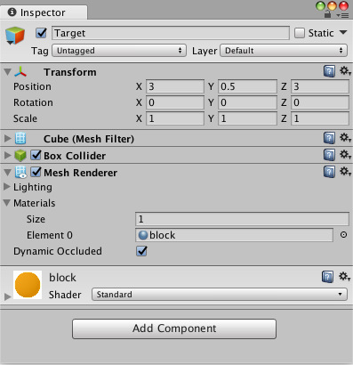

# 创建新的学习环境

本教程将介绍创建 Unity 环境的过程。Unity 环境是用 Unity 引擎构建的应用程序，可用于训练 Reinforcement Learning（强化学习）agent。

在此示例中，我们将训练一个球滚动到一个随机放置的立方体。这个球还要学习避免从平台上掉落。

## 概述

在 Unity 项目中使用 ML-Agents 涉及以下基本步骤：

1. 创建一个容纳 agent 的环境。从包含少量对象的简单物理模拟环境到整个游戏或生态系统，环境的形式可以多种多样。
2. 实现一个 Academy 子类，并将这个子类添加到包含该环境的 Unity 场景中的游戏对象 (GameObject)。此游戏对象将用作场景中任何 Brain 对象的父级。您的 Academy 类可以实现一些可选的方法，从而独立于任何 agent 来对场景进行更新。例如，您可以在环境中添加、移动或删除 agent 和其他实体。
3. 将一个或多个 Brain 对象作为 Academy 的子级添加到场景中。
4. 实现 Agent 子类。Agent 子类定义了必要的代码供 agent 用于观测自身环境、执行指定动作以及计算用于强化训练的奖励。您还可以实现可选方法，从而在 agent 完成任务或任务失败时重置 agent。
5. 将 Agent 子类添加到相应的游戏对象，通常是在场景内表示模拟中的 agent 的对象。必须为每个 Agent 对象分配一个 Brain 对象。
6. 如果要进行训练，应将 Brain 类型设置为 External 并[执行训练过程](/book/en-US/Training-ML-Agents.md)。

**注意：**如果您不熟悉 Unity，而本教程中未充分讲解 Editor 任务的情况下，请参阅 Unity 手册中的[了解界面](https://docs.unity3d.com/Manual/LearningtheInterface.html)。

如果尚未安装，请遵循[安装说明](Installation.md)。

## 设置 Unity 项目

要完成的第一项任务是创建一个新的 Unity 项目并将 ML-Agents Assets导入其中：

1. 启动 Unity Editor 并创建一个名为“RollerBall”的新项目。

2. 在你的文件系统中，找到包含您所克隆的 ML-Agents 代码仓库的文件夹。

3. 将 `ML-Agents` 文件夹从 `unity-environments/Assets` 拖到 Unity Editor Project 窗口中。

您的 Unity **Project** 窗口应包含  以下Assets：

## 创建环境：

接下来，我们将创建一个非常简单的场景来充当我们的 ML-Agents 环境。该环境的“physical”组件包括一个 Plane（充当 agent 移动的基础地板）、一个 Cube（充当 agent 寻找的目标）以及一个 Sphere（表示 agent 本身）。

**创建地板平板：**

1. 在 Hierarchy 窗口中右键单击，选择 3D Object > Plane。
2. 将游戏对象命名为“Floor”。
3. 选择 Plane 以便在 Inspector 窗口中查看其属性。
4. 将 Transform 设置为 Position = (0,0,0)、Rotation = (0,0,0)、Scale = (1,1,1)。
5. 在 Plane 的 Mesh Renderer 上，展开 Materials 属性并将默认材质更改为 *floor*。

（要设置新材质，请单击当前材质名称旁边的小圆圈图标。此时将打开 **Object Picker** 对话框，然后便可从项目中当前所有材质的列表中选择不同的材质。）

**添加目标立方体**

1. 在 Hierarchy 窗口中右键单击，选择 3D Object > Cube。
2. 将游戏对象命名为“Target”
3. 选择 Target 以便在 Inspector 窗口中查看其属性。
4. 将 Transform 设置为 Position = (3,0.5,3)、Rotation = (0,0,0)、Scale = (1,1,1)。
5. 在 Cube 的 Mesh Renderer 上，展开 Materials 属性并将默认材质更改为 *block*。

**添加 Agent 球体**

1. 在 Hierarchy 窗口中右键单击，选择 3D Object > Sphere。
2. 将游戏对象命名为“RollerAgent”
3. 选择 Target 以便在 Inspector 窗口中查看其属性。
4. 将 Transform 设置为 Position = (0,0.5,0)、Rotation = (0,0,0)、Scale = (1,1,1)。
5. 在 Sphere 的 Mesh Renderer 上，展开 Materials 属性并将默认材质更改为 *checker 1*。
6. 单击 **Add Component**。
7. 向 Sphere 添加 Physics/Rigidbody 组件。（添加 Rigidbody）

请注意，我们将在本教程的稍后部分创建一个 Agent 子类以作为组件添加到此游戏对象。

**添加空游戏对象来容纳 Academy 和 Brain**

1. 在 Hierarchy 窗口中右键单击，选择 Create Empty。
2. 将游戏对象命名为“Academy”
3. 右键单击 Academy 游戏对象，然后选择 Create Empty。
4. 将 Academy 的此子级命名为“Brain”。

您可以调整摄像机角度以便在运行时更好地查看场景。接下来的步骤是创建并添加 ML-Agent 组件。

