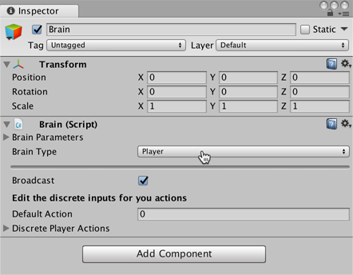

## 实现 Academy

Academy 对象可在场景中协调 ML-Agents 并驱动模拟中的决策部分。每个 ML-Agent 场景需要一个 Academy 实例。由于 Academy 基类是抽象的，即使不需要对特定环境使用任何方法，您也必须创建自己的子类。

首先，将一个 New Script 组件添加到先前创建的 Academy 游戏对象：

1. 选择 Academy 游戏对象以便在 Inspector 窗口中查看该对象。
2. 单击 **Add Component**。
3. 在组件列表中单击 **New Script**（位于底部）。
4. 将该脚本命名为“RollerAcademy”。
5. 单击 **Create and Add**。

接下来，编辑新的 `RollerAcademy` 脚本：

1. 在 Unity Project 窗口中，双击 `RollerAcademy` 脚本，在代码编辑器中将其打开。（默认情况下，新脚本直接放置于 **Assets** 文件夹中。）
2. 在编辑器中，将基类从 `MonoBehaviour` 更改为 `Academy`。
3. 删除默认添加的 `Start()` 和 `Update()` 方法。

在这样的基本场景中，我们不需要 Academy 初始化、重置或以其他方式控制环境中的任何对象，因此我们采用最简单的 Academy 实现：

```csharp
public class RollerAcademy : Academy { }
```

Academy 属性的默认设置也适合该环境，因此我们无需在 Inspector 窗口中更改 RollerAcademy 组件的任何设置。


## 添加 Brain

Brain 对象内部封装了决策过程。Agent 将观测结果发送给自己的 Brain，并期望收到决策。Brain Type 设置决定了 Brain 如何决策。与 Academy 和 Agent 类不同，您不需要创建自己的 Brain 子类。

要创建 Brain：

1. 选择先前创建的 Brain 游戏对象以便在 Inspector 窗口中显示该对象的属性。
2. 单击 **Add Component**。
3. 选择 **Scripts/Brain** 组件以将其添加到该游戏对象。

我们稍后再讲解 Brain 属性，但现在将 Brain Type 保留为 **Player**。

