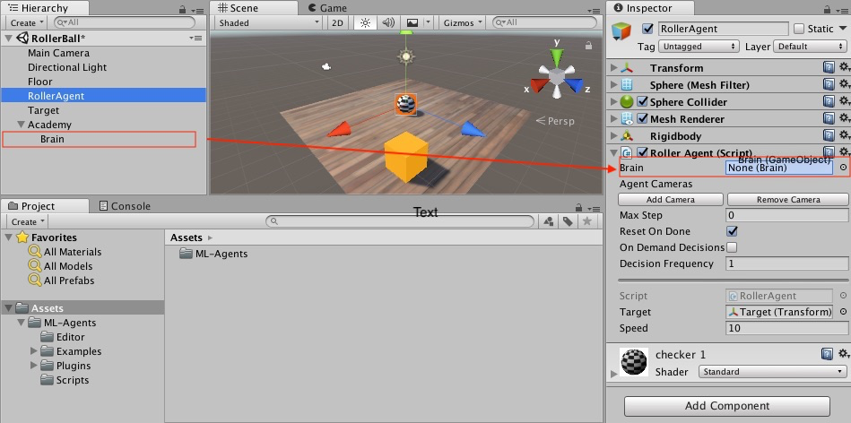
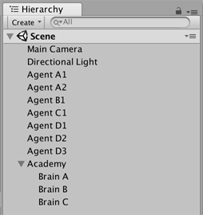

## 最终 Editor 设置

现在，所有游戏对象和 ML-Agent 组件都已准备就绪，因此可以在 Unity Editor 中将一切串起来了。这包括将 Brain 对象分配给 Agent，并设置 Brain 属性，使这些属性与我们的 agent 代码兼容。

1. 在 Hierarchy 窗口中展开 Academy 游戏对象，使 Brain 对象可见。
2. 选中 RollerAgent 游戏对象以便，在 Inspector 窗口中显示该对象的属性。
3. 将 Brain 对象从 Hierarchy 窗口拖到 RollerAgent 的 Brain 字段。

另外，将 Target 游戏对象从 Hierarchy 窗口拖到 RollerAgent 的 Target 字段。

最后，选择 Brain 游戏对象以便能够在 Inspector 窗口中查看该对象的属性。设置以下属性：

* `Vector Observation Space Type` = **Continuous**
* `Vector Observation Space Size` = 8
* `Vector Action Space Type` = **Continuous**
* `Vector Action Space Size` = 2
* `Brain Type` = **Player**

现在您已准备好在训练之前测试环境。

## 测试环境

在开始长时间进行训练之前，手动测试您的环境始终是一种明智的做法。我们将 Brain 设置为 **Player** 类型的原因是，我们可以使用直接的键盘控制方式来控制 agent。但首先，您需要将键盘定义为动作映射。尽管 RollerAgent 的 `Action Size` 仅为 2，但对于每个动作，我们将用一个键指定正值，再用一个键指定负值，因此总共为四个键。

1. 选择 Brain 游戏对象以便在 Inspector 中查看该对象的属性。
2. 将 **Brain Type** 设置为 **Player**。
3. 展开 **Continuous Player Actions**（仅在使用 **Player* Brain 时可见）。
4. 将 **Size** 设置为 4。
5. 设置以下映射：

| 元素   | 键 | 索引 | 值 |
| :------------ | :---: | :------: | :------: |
| 元素 0 | D   | 0        | 1        |
| 元素 1 | A    | 0        | -1       |
| 元素 2 | W  | 1        | 1        |
| 元素 3 | S   | 1        | -1       |

**Index** 值对应于传递给 `AgentAction()` 函数的动作数组的索引。**Value** 在 **Key** 被按下时分配给 action[Index]。

按 **Play** 运行场景，并用 WASD 键在平台上移动 agent。确保在 Unity Editor Console 窗口中没有显示任何错误，并且 agent 在到达目标或掉下平台时会重置。请注意，对于较复杂的调试，ML-Agents SDK 提供了一个方便的 Monitor 类，您可以使用该类轻松地在 Game 窗口中显示 agent 状态信息。

您可以执行一个额外的测试是，首先使用 `python/Basics` 
[Jupyter Notebook](/book/en-US/Background-Jupyter.md)
确保您的环境和 Python API 能正常工作。在 `Basics` 中，务必将 
`env_name` 设置为您生成的此环境对应的可执行文件的
名称。

现在可以开始训练 Agent 了。为了准备进行训练，必须首先将 **Brain Type** 从 **Player** 更改为 **External**。此后的过程与[训练 ML-Agents](/book/en-US/Training-ML-Agents.md) 中所述的过程相同。

## 回顾：场景布局

本节简要回顾了在 Unity 环境中使用 Agent 时
如何组织场景。

您需要在场景中包含三种游戏对象才能使用 Unity ML-Agents 工具包：
 * Academy
 * Brain
 * Agent

切记：
 * 场景中只能有一个 Academy 游戏对象。
 * 您可以拥有多个 Brain 游戏对象，但它们必须是 Academy 游戏对象的子级。

您的场景层级视图应该如以下示例所示：

